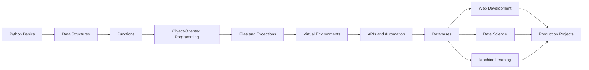

<div align="center">

# 🐍 Learn Python

### A practical, visual, and structured journey from Python beginner to advanced developer.


<br>


<br><br>

[](https://www.python.org/)
[](https://github.com/asifverse4/LEARN_PYTHON)
[](https://github.com/asifverse4/LEARN_PYTHON)
[](https://github.com/asifverse4/LEARN_PYTHON)

</div>

---

## ✨ About This Repository

**LEARN_PYTHON** is a curated learning hub containing useful Python resources, tutorials, courses, documentation, project ideas, and practical guidance.

Whether you are writing your first Python program or preparing for professional development, this repository is designed to help you learn progressively:

```text
Beginner → Fundamentals → Projects → Advanced Python → Career Skills
```

> Learn consistently. Build regularly. Improve permanently.

---

## 🧭 Python Learning Roadmap



### 1. Python Fundamentals

- Installing Python
- Variables and data types
- Numbers and strings
- Lists, tuples, sets, and dictionaries
- Conditional statements
- `for` and `while` loops
- Functions and scope
- Basic input and output
- Comments and code formatting

### 2. Intermediate Python

- List and dictionary comprehensions
- Modules and packages
- File handling
- Error handling
- Object-oriented programming
- Iterators and generators
- Decorators
- Lambda functions
- Virtual environments
- Package management with `pip`

### 3. Advanced Python

- Type hints
- Testing with `pytest`
- Asynchronous programming
- API development
- Database integration
- Software architecture
- Logging
- Performance optimization
- Deployment
- Clean code and design patterns

---

## 🧪 Your First Python Program

```python
def create_learning_message(name: str, topic: str) -> str:
    return f"Welcome {name}! Today you are learning {topic}."


message = create_learning_message("Developer", "Python")
print(message)
```

### Example Output

```text
Welcome Developer! Today you are learning Python.
```

---

## 🆓 Free Python Resources

| Resource | Best For | Link |
|---|---|---|
| Python Official Documentation | Complete language reference | [Visit](https://docs.python.org/3/) |
| Python Beginner's Guide | Starting from zero | [Visit](https://wiki.python.org/moin/BeginnersGuide) |
| Python Tutorial | Official fundamentals | [Visit](https://docs.python.org/3/tutorial/) |
| Real Python | Practical tutorials and explanations | [Visit](https://realpython.com/) |
| freeCodeCamp | Free long-form courses | [Visit](https://www.freecodecamp.org/learn/) |
| CS50P | Computer science with Python | [Visit](https://cs50.harvard.edu/python/) |
| Automate the Boring Stuff | Automation and scripting | [Visit](https://automatetheboringstuff.com/) |
| Kaggle Learn | Python and data science | [Visit](https://www.kaggle.com/learn) |
| Exercism Python Track | Practice and mentoring | [Visit](https://exercism.org/tracks/python) |
| Python Tutor | Visualize code execution | [Visit](https://pythontutor.com/) |

---

## 💎 Paid Python Resources

Paid courses can provide structured lessons, projects, exercises, certificates, and instructor support.

| Platform | Best For | Link |
|---|---|---|
| Udemy | Affordable project-based courses | [Explore](https://www.udemy.com/courses/development/programming-languages/python/) |
| DataCamp | Interactive Python and data learning | [Explore](https://www.datacamp.com/) |
| Codecademy | Interactive beginner-friendly lessons | [Explore](https://www.codecademy.com/catalog/language/python) |
| Pluralsight | Professional developer paths | [Explore](https://www.pluralsight.com/browse/software-development) |
| Coursera | University and industry certificates | [Explore](https://www.coursera.org/browse/computer-science) |
| Educative | Interactive text-based courses | [Explore](https://www.educative.io/) |
| Real Python Membership | Deep practical Python content | [Explore](https://realpython.com/) |

> Course availability, pricing, and content can change. Always review the official course page before purchasing.

---

## ⚖️ Free vs Paid Learning

| Category | Free Resources | Paid Resources |
|---|---|---|
| Cost | No financial cost | Requires an investment |
| Structure | You create your own path | Usually follows a planned path |
| Flexibility | Highly flexible | Often includes schedules or milestones |
| Support | Community and documentation | May include mentors or instructors |
| Projects | Varies by resource | Often included in the curriculum |
| Certificates | Sometimes unavailable | Commonly available |
| Best For | Self-motivated learners | Learners wanting guided progress |

### Recommended Strategy

```text
Use free resources to explore.
Use projects to practice.
Use paid resources only when you need structure, accountability, or specialization.
```

---

## 🛠️ Project Ideas

### Beginner Projects

- Number guessing game
- Calculator
- Unit converter
- Digital clock
- Rock-paper-scissors
- Quiz application
- Password generator
- To-do list in the terminal

### Intermediate Projects

- Weather API application
- Web scraper
- Expense tracker
- File organizer
- URL shortener
- Blog application
- Chat application
- Personal finance dashboard

### Advanced Projects

- REST API with FastAPI
- Full-stack web application
- Recommendation system
- Machine learning project
- Automation platform
- Real-time notification service
- Data pipeline
- Python package published to PyPI

---

## 📁 Suggested Project Structure

```text
my-python-project/
│
├── src/
│   └── app.py
│
├── tests/
│   └── test_app.py
│
├── .gitignore
├── README.md
├── requirements.txt
└── pyproject.toml
```

---

## 🚀 Recommended Learning Workflow

### Step 1: Learn the concept

Read documentation, watch a lesson, or follow a tutorial.

### Step 2: Write the code yourself

Avoid copying code without understanding it.

### Step 3: Modify the example

Change variables, add features, and intentionally experiment.

### Step 4: Build a small project

Use the concept in a real application.

### Step 5: Debug your mistakes

Errors are part of the learning process.

### Step 6: Document your work

Add a README, screenshots, instructions, and lessons learned.

### Step 7: Repeat consistently

Small daily progress is more effective than occasional intensive sessions.

---

## 🧰 Useful Python Tools

| Tool | Purpose |
|---|---|
| `venv` | Create isolated Python environments |
| `pip` | Install Python packages |
| `pytest` | Write and run tests |
| `black` | Format Python code |
| `ruff` | Lint and analyze Python code |
| `mypy` | Check type hints |
| `Git` | Track code changes |
| `Jupyter` | Interactive experiments and notebooks |
| `FastAPI` | Build modern APIs |
| `Django` | Build full web applications |

---

## 💻 Virtual Environment Setup

### Windows

```bash
python -m venv .venv
.venv\Scripts\activate
```

### macOS and Linux

```bash
python3 -m venv .venv
source .venv/bin/activate
```

### Install Packages

```bash
python -m pip install --upgrade pip
pip install requests pytest
```

### Save Dependencies

```bash
pip freeze > requirements.txt
```

---

## 🔥 Python Productivity Tips

- Practice by building projects, not only watching tutorials.
- Read error messages carefully.
- Use official documentation.
- Keep functions small and focused.
- Choose clear variable names.
- Write tests for important logic.
- Use Git from the beginning.
- Refactor old projects after learning new concepts.
- Share your projects publicly.
- Learn how to read other people's code.
- Focus on consistency instead of perfection.

---

## 📊 A Simple Weekly Plan

| Day | Focus |
|---|---|
| Monday | Learn one new concept |
| Tuesday | Solve small exercises |
| Wednesday | Read documentation |
| Thursday | Build a project feature |
| Friday | Debug and refactor |
| Saturday | Work on a complete project |
| Sunday | Review and plan the next week |

---

## 🎯 Learning Goals

Use this checklist to track your progress:

- [ ] Understand Python syntax
- [ ] Work confidently with data structures
- [ ] Write reusable functions
- [ ] Understand object-oriented programming
- [ ] Work with files and APIs
- [ ] Use virtual environments
- [ ] Write automated tests
- [ ] Use Git and GitHub
- [ ] Build real-world projects
- [ ] Choose a specialization
- [ ] Publish a portfolio project
- [ ] Contribute to open source

---

## 🌌 The Python Mindset

```python
while not expert:
    learn()
    practice()
    build()
    debug()
    improve()
```

Every experienced developer was once confused by the same errors, unfamiliar syntax, and difficult projects.

Keep writing code.

---

## 🤝 Contributing

Suggestions, useful resources, project ideas, and improvements are welcome.

To contribute:

1. Fork this repository.
2. Create a new branch.
3. Add or improve a resource.
4. Check links and formatting.
5. Submit a pull request.

Please keep contributions:

- Relevant to Python learning
- Beginner-friendly where possible
- Clearly explained
- Free from misleading claims
- Properly linked to official sources

---

## ⭐ Support This Repository

If this repository helps you learn Python:

- Star the repository
- Share it with another learner
- Suggest a useful resource
- Add a project idea
- Contribute improvements

<div align="center">

### Keep learning. Keep building. Keep improving. 🐍


</div>
